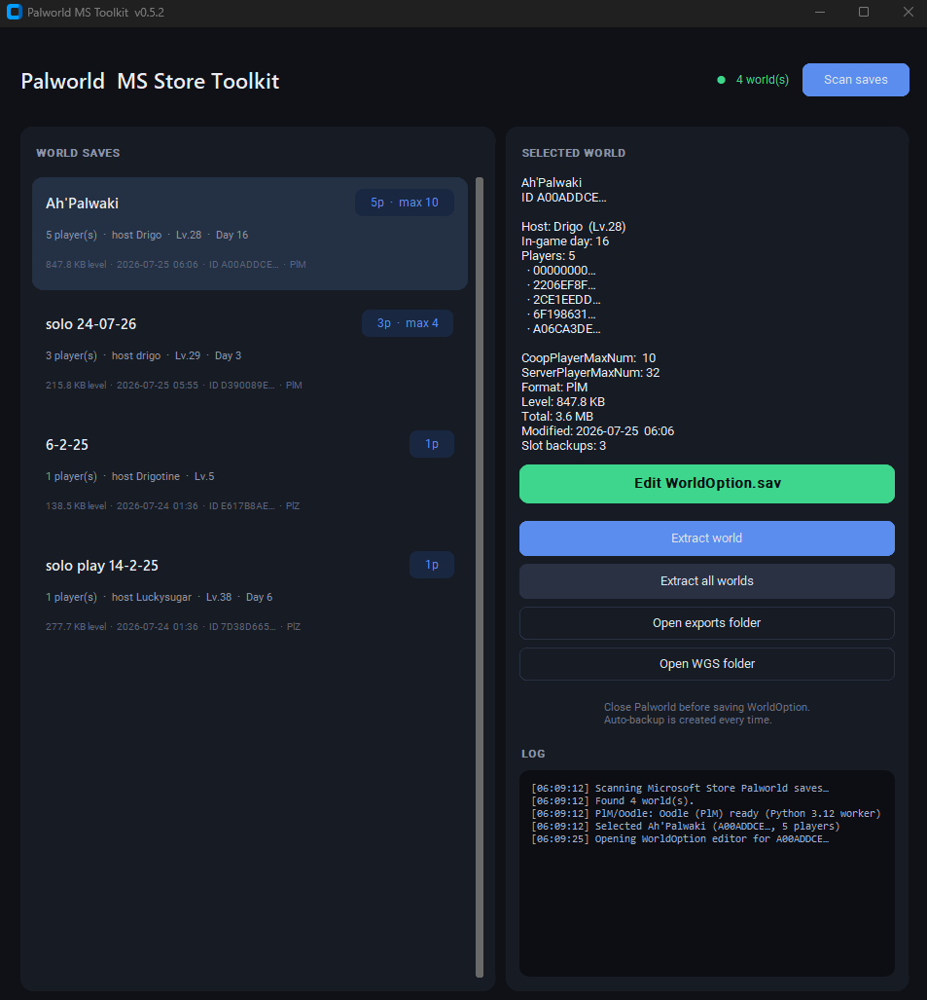
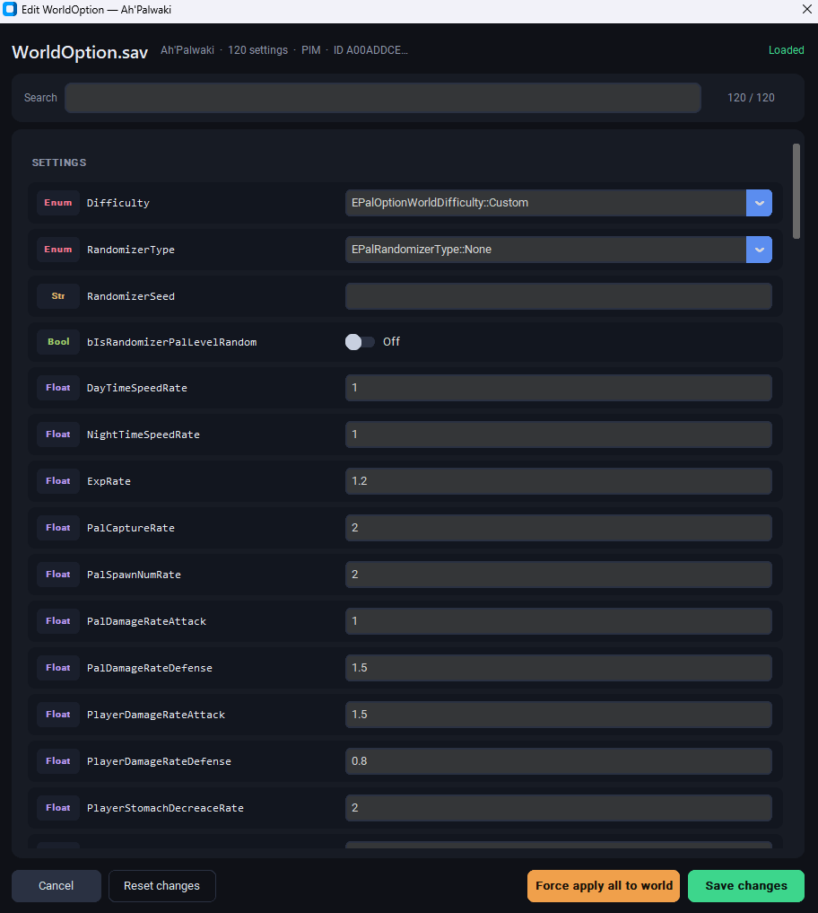

# Palworld MS Store WorldOption.sav Editor

### Edit co-op slots and world settings for Microsoft Store / Game Pass Palworld

WGS containers. PlZ + PlM. Dark GUI. Auto-backup. No manual path hunting.

**Author:** [Luckisugar](https://github.com/Luckisugar) · **Repo:** [PalWorld-Microsoft-Store-WorldOption.sav-Editor](https://github.com/Luckisugar/PalWorld-Microsoft-Store-WorldOption.sav-Editor)

[Features](#-features) · [Install](#-install) · [Usage](#-usage) · [Notes](#-notes)

---

## Why this exists

Microsoft Store / PC Game Pass Palworld saves live in **Xbox WGS** containers under `%LocalAppData%\Packages\…` — not the Steam path.  
Editing **co-op player max** (and other `WorldOption.sav` fields) by hand is pain.

This tool scans worlds, opens `WorldOption.sav` (**PlZ zlib** or **PlM Oodle**), lets you edit settings (including **CoopPlayerMaxNum**), and writes back with an auto-backup.

---

## Screenshots

  

  

---

## Features

| | |
|:--|:--|
| **Scan worlds** | Lists MS Store worlds (players, size, modified, co-op max) |
| **Edit WorldOption.sav** | Full settings editor with search |
| **Extract world** | Unpacks to a normal (Steam-like) folder layout |
| **Extract all** | Full account dump |
| **Auto-backup** | Original blob copied before every save |
| **PlZ + PlM** | Older zlib and newer Oodle saves |

---

## Install

1. Clone or download this repo  
2. Install **Python 3.10+** with **tkinter** ([python.org](https://www.python.org/downloads/))  
3. Double-click **`run.bat`** (or run `bootstrap.ps1` / `python app.py` as documented in-repo)

### PlM (Oodle) support

Newer worlds use **PlM**. In the app, use **Install PlM support** — it fetches an official embeddable Python runtime and wires PlM deps under `%LOCALAPPDATA%\PalworldMSTool\`.

---

## Usage

1. Launch the tool  
2. **Scan** for MS Store worlds  
3. Open a world → edit **WorldOption** (search for co-op / player fields)  
4. Save — backup is created automatically  

---

## Notes

- **MS Store / Game Pass PC** path model — not a Steam-only tool  
- Close the game before writing saves when possible  
- You break it, you buy it — keep backups (the tool already does one)

---

## Star History

---

Made for gamers who refuse the 4-player cap · [Luckisugar](https://github.com/Luckisugar)

